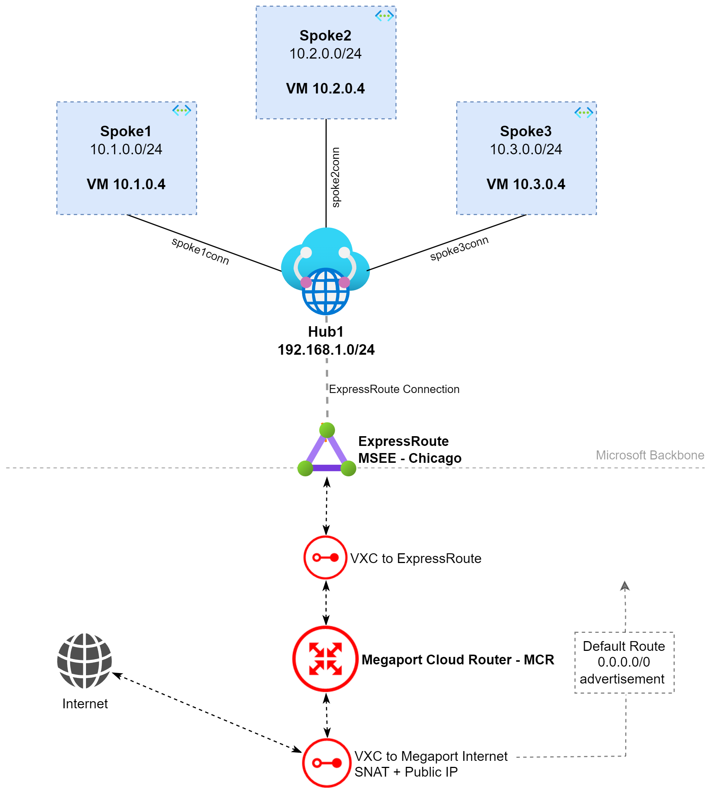
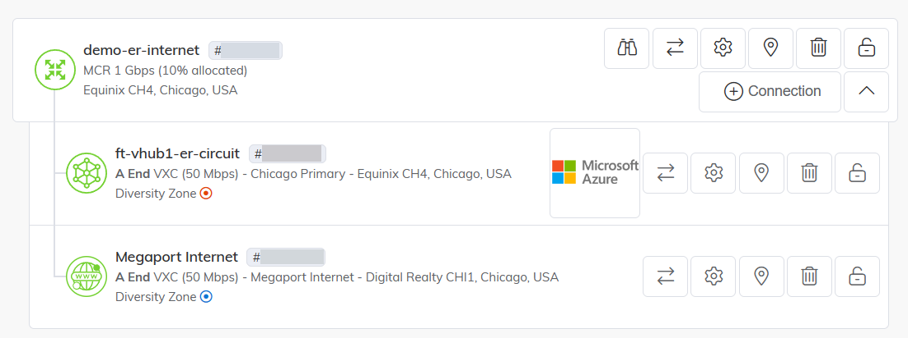
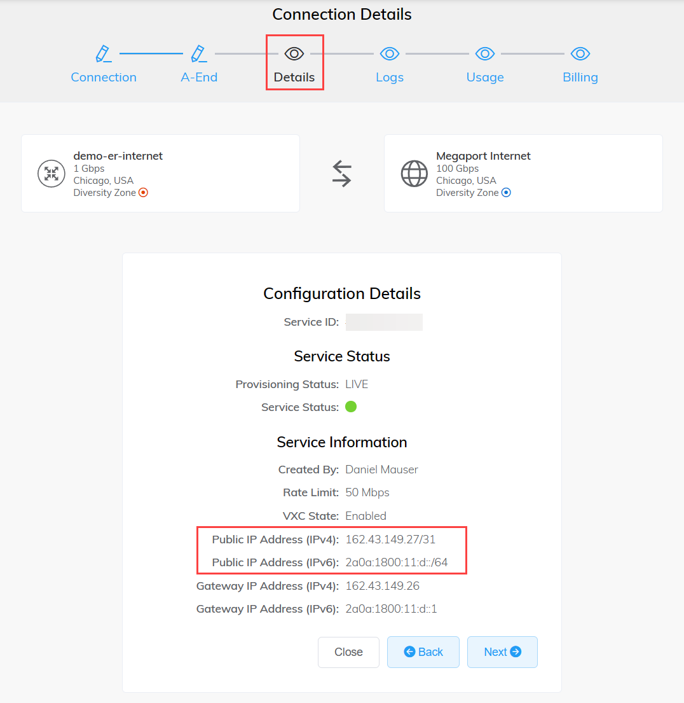
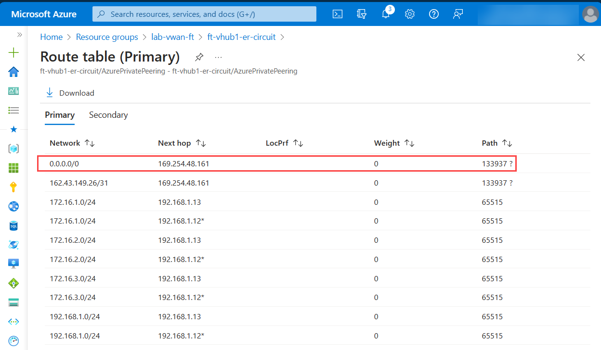
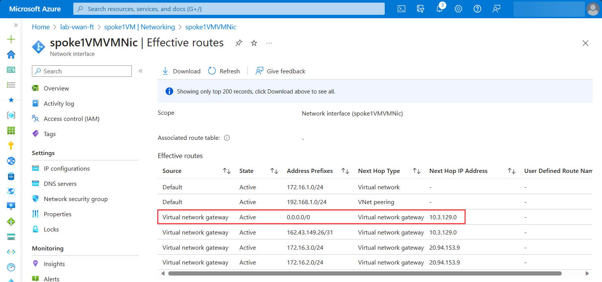

# Lab: Virtual WAN and forced tunneling over ExpressRoute

## Intro

This lab aims to build a Virtual WAN with tree spokes and force tunneling Internet traffic over ExpressRoute using [Megaport Internet](https://docs.megaport.com/megaport-internet/).

## Lab Diagram



## Lab Steps

To provision this lab, follow those two simple steps:

- Step 1: Build vWAN base environment using CLI script: , or run the following command:

```bash
curl -s https://raw.githubusercontent.com/dmauser/azure-virtualwan/main/ft-wan/ft-deploy-vwan.azcli | bash
```	
  
Note 1: CLI is bash format. Please, use Azure Cloud Shell Bash to run the script or Azure CLI for Linux. This script does not work over Azure CLI for Windows.

- Step 2: Provision a MCR and create two connections:
  
    1) VXC for Azure / ExpressRoute See: [Creating an ExpressRoute connection](https://docs.megaport.com/cloud/megaport/microsoft/#creating-an-expressroute-connection).
    2) VXC for Megaport Internet.

    Here is how the MCR connections should look like:
    


    Note 2: The script will finish only when the ER Circuit is provisioned at the Provider side.

    Here is how the MCR should look like with both VXCs (ExpressRoute and Megaport Internet) should look like:

    

## Validations

1) Review Megaport Internet connection status and Public IP.



2) Review how default route is injected on the MCR via Looking Glass.


3) Review how default route is injected on the ExpressRoute Circuit.




4) Check in Virtual WAN default route table the default route injected.


5) Ensure the VNET connections have default route enabled as shown:


6) Dump Spoke1VM NIC effective routes and check if default route is populated with the Virual Newtork Gateways as next hop.



7) Login to Spoke1VM validated the its Public IP:
    
    ```bash
    curl ifconfig.io
    ```
