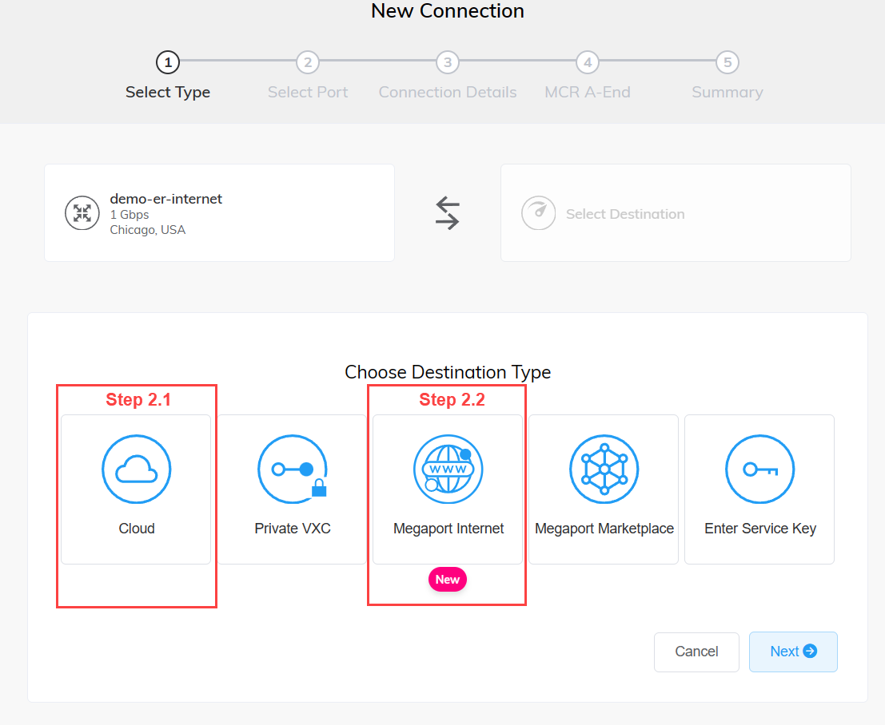
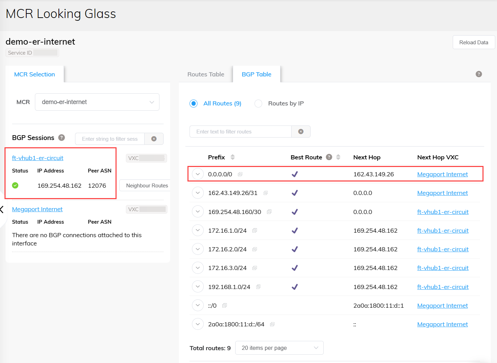
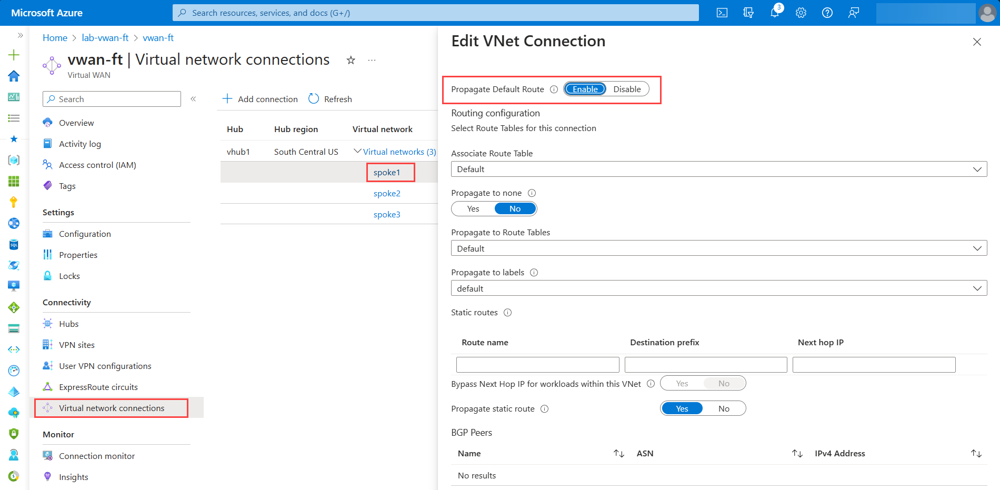

# Lab: Virtual WAN and forced tunneling over ExpressRoute

Content:

[Intro](#intro)
[Lab Diagram](#lab-diagram)
[Deploy this solution](#deploy-this-solution)
[Validations]


## Intro

This lab aims to build a Virtual WAN with tree spokes and force tunneling Internet traffic over ExpressRoute using [Megaport Internet](https://docs.megaport.com/megaport-internet/) to demonstrate scenarios where customers can use ExpressRoute for Internet access (also known as forced tunneling).

This lab leverages [MegaPort Cloud Router (MCR)](https://docs.megaport.com/mcr/) and two Virtual Cross Connects (VXCs): ExpressRoute and Megaport Internet service.

## Lab Diagram


## Deploy this solution

To provision this lab, follow those two simple steps:

**Step 1**: Build vWAN base environment using CLI script: [ft-deploy-vwan.azcli](./ft-deploy-vwan.azcli), or run the following command:

```bash
curl -s https://raw.githubusercontent.com/dmauser/azure-virtualwan/main/ft-wan/ft-deploy-vwan.azcli | bash
```

**Note 1**: CLI is in bash format. PPlease run the script using Azure Cloud Shell Bash or Azure CLI for Linux. This script does not work over Azure CLI for Windows.

**Step 2:** Provision a an MCR and create two VXCs:

  2.1 - The first VXC should be associated with the Azure ExpressRoute. For more details, consult: [Creating an ExpressRoute connection](https://docs.megaport.com/cloud/megaport/microsoft/#creating-an-expressroute-connection).

  2.2 - The second VXC is for Megaport Internet. For more details, consult: [Creating a Megaport Internet Connection for an MCR](https://docs.megaport.com/megaport-internet/mcr/).

  Here is how the MCR options during the process of creating both VXCs:

  

**Note 2**: The script will finish when the ER Circuit is provisioned at the Provider side.

Here is how the MCR should look like with both VXCs (ExpressRoute and Megaport Internet) should look like:


## Validations

1) Review Megaport Internet connection status and associated Public IP.


2) Review how the default route is injected on the MCR via Looking Glass.



3) Review how the default route is injected on the ExpressRoute Circuit.


4) On the Virtual WAN default route table see how the default route is injected.


5) Ensure each VNET connection has the default route enabled as shown:



6) Dump the Spoke1VM NIC effective routes and check the default route, which should show as next hop Virtual Network Gateway, which means it is learning from the vHub.


7) Login to Spoke1VM via Serial Console, and check its Public IP:
   
   ```bash
   curl ifconfig.io
   ```
   
   