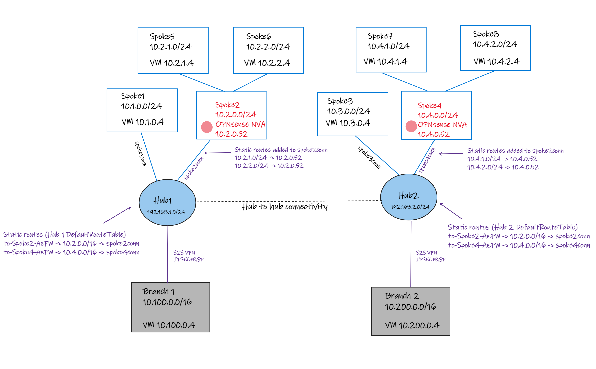

# Lab - Virtual WAN Scenario: Route traffic through an OPNsense NVA spoke

## Intro

The goal of this lab is to demonstrate and validate the Azure Virtual WAN scenario to route traffic through an NVA (using opensource OPNsense), the same published by the vWAN official document [Scenario: Route traffic through an NVA](https://docs.microsoft.com/en-us/azure/virtual-wan/scenario-route-through-nva).

### Lab diagram

The lab uses the same amount of VNETs (eight total) and two regions with Hubs, and the remote connectivity to two branches using site-to-site VPN using and BGP. Below is a diagram of what you should expect to get deployed:



### Components

- Two Virtual WAN Hubs in two different regions (you can change the regions over the script under parameters section).
- Eight VNETs (Spoke 1 to 8) where:
    - Four VNETs (spoke 1, 2, 3, and 4) are connected directly to their respective vHUBs.
    - The other four (indirect spokes) spoke 5, 6, 7, and 8.
    - Transit between indirect  Spoke2 and Spoke4 with OPNsense NVA.
- Each VNET (except 2 and 4) has a Linux VM accessible from SSH (need to adjust NSG to allow access) or serial console.
- All Linux VMs include basic networking utilities such as: traceroute, tcptraceroute, hping3, nmap, curl.
    - For connectivity tests, you can use curl <"Destnation IP"> and the output should be the VM name.
    - All VMs have default username azureuser and password Msft123Msft123 (you can change it under parameters section)
- There's UDRs associated to the indirect spoke VNETs 5, 6, 7, 8 with default route 0/0 to their respective OPNsense NVA spoke.
- Virtual WAN hubs have routes to OPNsense NVA spokes using summaries routes (10.2.0.0/16 -> Spoke2conn, 10.4.0.0/16 -> Spoke2conn)
- Spoke2conn and Spoke4conn have specific routes 10.2.1.0/24 and 10.2.2.0/24 next hop to spoke 2 OPNsense NVA trusted nic IP and 10.4.1.0/24 and 10.4.2.0/24 next hop to spoke 4 OPNsense NVA trusted nic IP.
- OPNsense has been pre-configured during provisioning to allow any traffic and route private traffic (RFC 1918 ranges) to the trusted interface.
    - OPNsense default username is root and password is opnsense (all lowercase).
- There are two Branches locations (Branch1 - 10.100.0.0/16 and Branch2 - 10.200.0.0/16) each one connected to their respective vHUBs using S2S IPSec VPN + BGP (Branch 1 using ASN 65009 and Branch 2 using ASN 65010).
- The outcome of the lab will be full transit between all ends (all VMs can reach each other).

### Deploy this solution

The lab is also available in the above .azcli that you can rename as .sh (shell script) and execute. You can open [Azure Cloud Shell (Bash)](https://shell.azure.com) and run the following commands build the entire lab:

```bash
wget -O irnva-deploy.sh https://raw.githubusercontent.com/dmauser/azure-virtualwan/main/inter-region-nva/irnva-deploy.azcli
chmod +xr irnva-deploy.sh
./irnva-deploy.sh 
```

**Note:** the provisioning process will take around 60 minutes to complete.

Alternatively (recommended), you can run step-by-step to get familiar with the provisioning process and the components deployed:

```bash

```

### Validation

```bash
```

### Clean-up

```bash

```