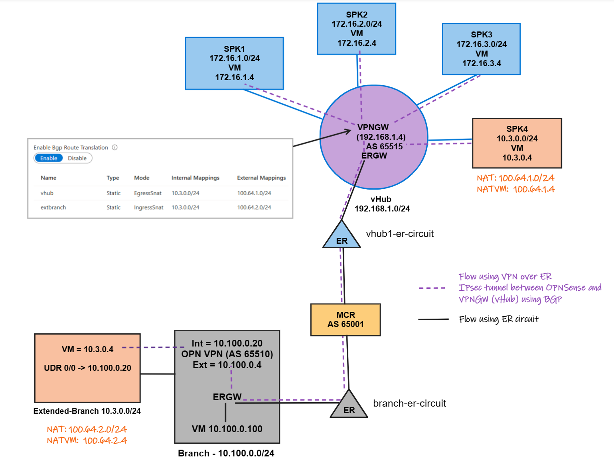
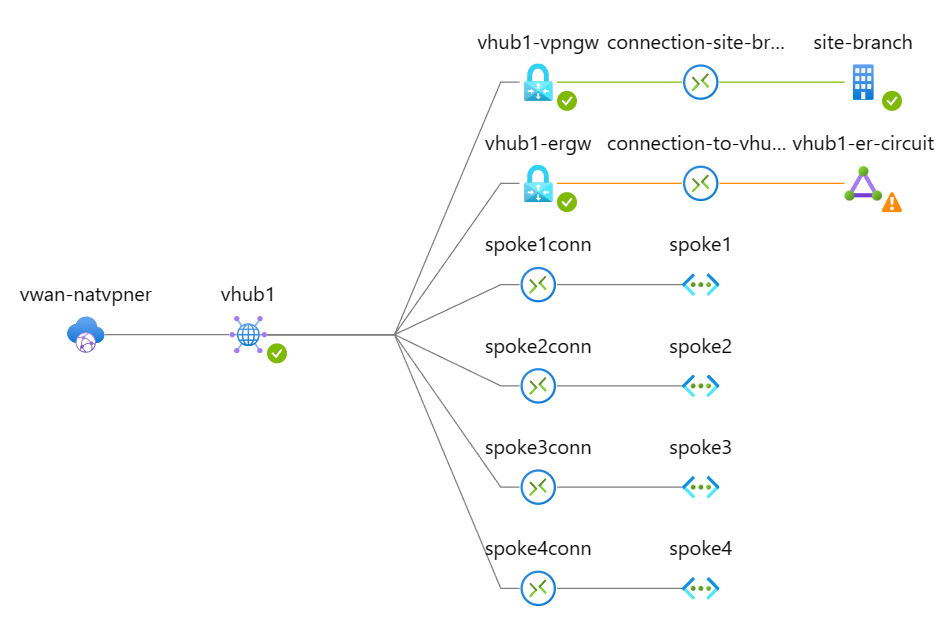

# Lab - Virtual WAN Scenario: IPsec VPN with NAT over ER

## Intro

The goal of this lab is to validate IPSec over ExpressRoute using Virtual WAN to address overlapping IP prefixes by leveraging vWAN VPN Gateway NAT feature.
You may be familiar with the official vWAN documentation on this subject. However, the scenario covered over the official documentation is two remote branches with the same overlapping IP, for more information consult: [Configure NAT rules for your Virtual WAN VPN gateway](https://learn.microsoft.com/en-us/azure/virtual-wan/nat-rules-vpn-gateway). The intention here is to address scenarios where there are Azure and On-premises with overlapping IP prefixes.

For the scenario covered in this lab, two networks are using the same IP prefix (10.3.0.0/24), one on-premises (extended branch) and another in Azure VNET (Spoke4) connected to Virtual WAN.
That is to demonstrate that you can use IPSec + NAT VPN Gateway functionality to handle overlapping IP scenarios usually common on Vendor integration or merging and acquisitions.
Another important point to highlight for the context of this lab is the overlapping traffic goes over IPSec VPN the other non-overlapping traffic goes over regular ExpressRoute.

## Lab Diagram



On the diagram above, the extended branch, VM (10.3.0.4) always goes over IPSec over ExpressRoute when communicating with any Spoke Azure VM. It will always show it with source IP 100.64.2.4.
Azure VM on the spoke 4 (10.3.0.4) will reach the extended branch VM using 100.64.2.4 but it will show its source IP as 100.64.1.4.

## Considerations and requirements

- An Extended-Branch with prefix range 10.3.0.0/24 overlaps with Spoke4 VNET connected to the vHUB.
 - 100.64.1.0/24 is the NAT address prefix associated with the Spoke4 VNET.
 - 100.64.2.0/24 is the NAT address prefix associated with the extended branch.
- Traffic between Extended-Branch and all vWAN-connected spokes (1,2,3 and 4) will always go over IPSec over ER and get translated to 100.64.2.0/24 (as source) when hits any of those VNETS. On the other way, vWAN-connected spokes will reach Extended-Branch using IPSec over ER but only Spoke4 VNET gets translated to 100.64.2.0/24. The remaining spoke VNETs 1,2 and 3 will retain their address space (see connectivity tests output for more information)
- Branch (10.100.0.0/24) has an NVA OPNSense preconfigured with S2S VPN reaching both vWAN VPN Gateway instances using private IPs 192.168.1.4 and 192.168.1.5.
  - Note that **OPNsense** used as VPN Server has **username:root** and **password:opnsense** and its accessible via HTTPS over its public IP associated to the untrusted NIC.
  - A BGP session is configured between the VTI interfaces (10.200.0.1) and both vWAN VPN Gateway instances BGP IPs 192.168.1.14 and 192.168.1.15.
  - You have to advertise the 10.3.0.0/24 (overlapping with Azure) in order to vWAN VPN Gateway NAT rule to translate it to 100.64.2.0/24.
  - **Special note** BGP over APIPA does not work over NAT, you have to use default BGP IP addresses vWAN VPN Gateway .14 and .15
 - This lab creates two Expressroute circuits and requires you to provision them with an ER connectivity provider. In this particular lab, I used MegaPort Cloud Router (MCR) to connect both ER circuits.
 - All VMs are Linux Ubuntu accessible via SSH restricted by your Public IP (see $mypip parameter) or using Serial Console.

## Deploy this solution

The lab is also available in the above .azcli that you can rename as .sh (shell script) and execute. You can open [Azure Cloud Shell (Bash)](https://shell.azure.com).

Review the parameters below and make changes based on your needs:

```Bash
#Parameters
region=southcentralus
rg=lab-vwan-vpner
vwanname=vwan-vpner
hubname=vhub1
username=azureuser
password="Msft123Msft123" #Please change your password
vmsize=Standard_B1s #VM Size
mypip=$(curl -4 ifconfig.io -s) #Replace with your home Public IP in case you run this over Cloudshell
```

Please, run the following steps to build the entire lab:

### Step 1 - Deploy the Lab

```bash
wget -O vwan-natvpner-deploy.sh https://raw.githubusercontent.com/dmauser/azure-virtualwan/main/natvpn-over-er/natvpner-deploy.azcli
chmod +xr vwan-natvpner-deploy.sh
./vwan-natvpner-deploy.sh
```

### Step 2 - Provision ER Circuits with Provider

Ensure that ExpressRoute Circuits er-circuit-vhub1 and er-circuit-branch are provisioned. That is required to connect them to the respective ER Gateways in Step 3.

### Step 3 - Connect ER Circuit

In this step, the script below connects branch-er-circuit to the Branch ER Gateway and vhub1-er-circuit to the vHub ER Gateway.

```bash
wget -O vwan-natvpner-conn.sh https://raw.githubusercontent.com/dmauser/azure-virtualwan/main/vpn-over-er/natvpner-conn.azcli
chmod +xr vwan-natvpner-conn.sh
./vwan-natvpner-conn.sh
```

## Validation

In the below sections, we have a breakdown of the vWAN configuration highlighting some important points of this solution.

### Azure Virtual WAN

#### Azure Virtual WAN Topology

Via the networking insights, we can get a good view of the vWAN topology and its components.



#### vHUB VPN Gateway configuration
VPN Gateways, a special highlight for the Private IP addresses and the default BGP IP Address. For NAT you must use Default BGP IP addresses. It does not work with Custom BGP IP addresses listed below as APIPA.


#### vHUB VPN Gateway NAT rules


#### VPN Gateway BGP Dashboard

1. BGP peer status

There are two BGP sessions over IPSec with the remote OPNSense BGP IP 10.200.0.1 as shown:


2. VPN Gateway advertised routes

The connected Spoke4 VNET which has 10.3.0.0/24 will be advertised as 100.64.1.0/24 as shown:


3. VPN Gateway learned routes


#### Azure vWAN Effective Routes
