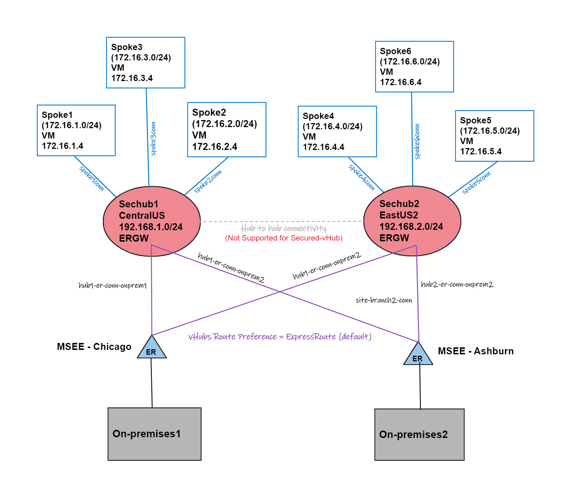

# Lab - Secured Virtual Hubs Inter-region via ExpressRoute

## Intro

This lab demonstrates two Secured-vHubs (Virtual WAN Hub + Azure Firewall) deployed in different Azure regions and using Cross-connected ExpressRoute circuits for inter-hub traffic.

## Network topology



## Considerations

- This is a Secured-vHub deployment without Routing Intent/Routing Policies (Preview)
- Inter-Hub with Secured-vHUB without Routing Intent/Policies are only possible using ExpressRoute cross-connected (this is a workaround for the limitation: [Filtering inter-hub traffic in secure virtual hub deployments](https://learn.microsoft.com/en-us/azure/firewall-manager/overview#known-issues)).
- Inter-Hub Virtual WAN Hub has route preference when ExpressRoute circuits are cross-connected.
- Azure Firewalls get deployed on each vHub, but you must manually enable Private and Internet traffic to the Azure Firewall in the vHub using Firewall Manager. See instructions [here]:(https://learn.microsoft.com/en-us/azure/firewall-manager/secure-cloud-network#route-traffic-to-your-hub).
- Two ExpressRoute circuits are deployed but not provisioned. You have to use your provider.

## Deploy this solution

The lab is also available in the above .azcli that you can rename as .sh (shell script) and execute. You can open [Azure Cloud Shell (Bash)](https://shell.azure.com) and run the following commands to build the entire lab:

```bash
wget -O svh-irer-deploy.sh https://raw.githubusercontent.com/dmauser/azure-virtualwan/main/svh-inter-region-er/svh-irer-deploy.azcli
chmod +xr svh-irer-deploy.sh
./svh-irer-deploy.sh
```

### Default parameters:

```bash
# variables (make changes based on your requirements)
region1=centralus #set region1
region2=eastus2 #set region2
rg=lab-svh-irer #set resource group
vwanname=svh-irer #set vwan name
hub1name=svhub1 #set secured-vhub1 name
hub2name=svhub2 #set secured-vhub2 name
username=azureuser # set username
password="Msft123Msft123" #set password
vmsize=Standard_B1s #set vm size
mypip=$(curl -4 ifconfig.io -s) #get your Public IP and set NSG as a source for SSH access.

#ExpressRoute specific variables
ername1="er-ckt-$hub1name" 
perloc1="Chicago"
providerloc1=Megaport
ername2="er-ckt-$hub2name" 
perloc2="Washington DC"
providerloc2=Megaport
```

**Note:** the provisioning process will take around 60 minutes to complete.

### Extra steps after deployment

1. Deploy ExpressRoute with your provider.
2. Secure Private Traffic and Internet Traffic using Firewall Manager. See instructions [here]:(https://learn.microsoft.com/en-us/azure/firewall-manager/secure-cloud-network#route-traffic-to-your-hub).
3. Connect both ExpressRoutes to each Hub.
