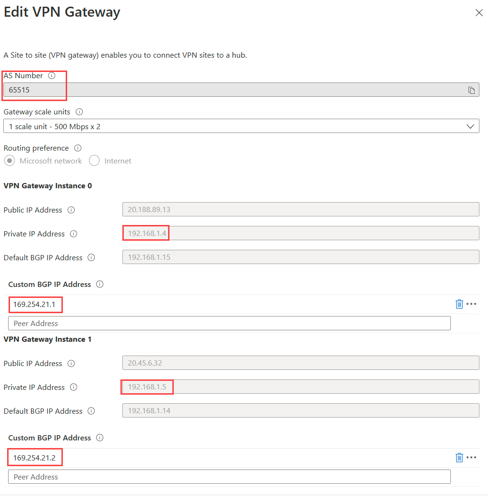
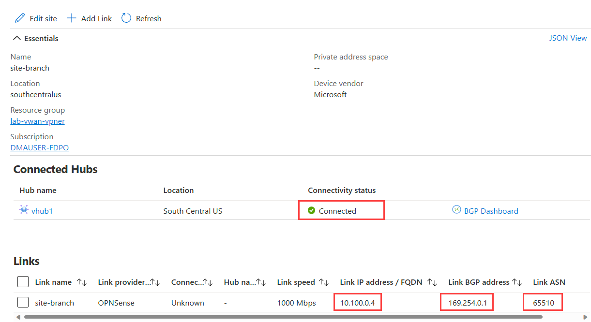
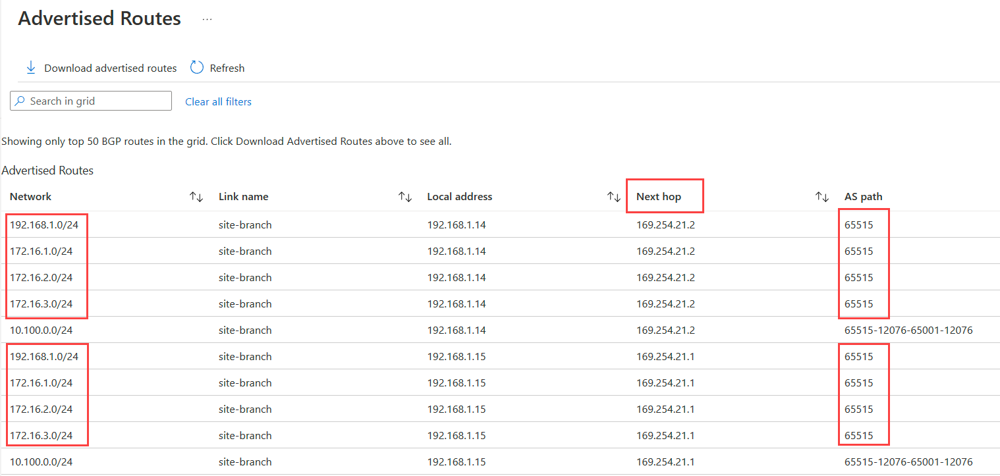
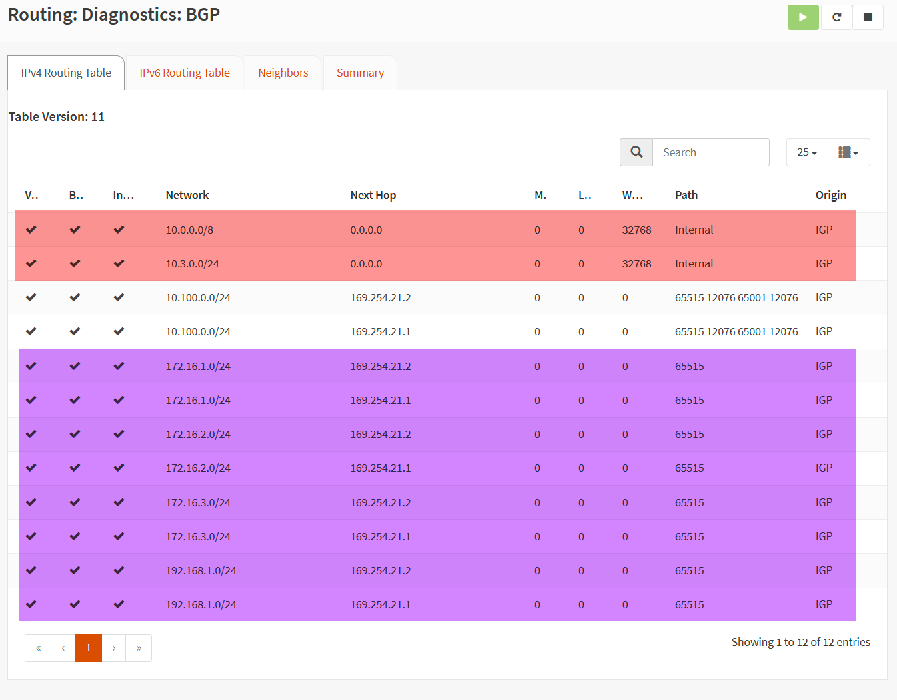

# Lab - Virtual WAN Scenario: IPsec VPN over ER

## Intro

The goal of this lab is to validate IPSec over Express Route using Virtual WAN leveraging only Azure to emulate On-premises.
You can find the official Microsoft reference for that functionality in [ExpressRoute encryption](https://learn.microsoft.com/en-us/azure/virtual-wan/vpn-over-expressroute): IPsec over ExpressRoute for Virtual WAN](https://learn.microsoft.com/en-us/azure/virtual-wan/vpn-over-expressroute)

## Lab diagram


## Considerations and requirements

- An on-premises emulated in Azure using two networks 10.100.0.0/24 and 10.3.0.0/24.
- This solution requires two ExpressRoute (ER) circuits connected via an ER Service Provider. This lab uses Megaport and MCR (Megaport Cloud Router) and connected both circuits to the same MCR (ASN 65001).
- An Extended-Branch with prefix range 10.3.0.0/24 was created to avoid the routing leaking over ExpressRoute. Therefore, there's no need to configure route filters.
  - The Extended-Branch has a UDR 0.0.0.0/0 next hop to the OPNsense internal interface (10.100.0.20).
- The Branch (10.100.0.0/24) has an NVA OPNsense preconfigured with S2S VPN reaching both vWAN VPN Gateway instances using private IPs 192.168.1.4 and 192.168.1.5.
  - Note that **OPNsense** used as VPN Server has **username:root** and **password:opnsense** and its accessible via HTTPS over its public IP associated with the untrusted NIC.
  - A BGP session is configured between the VTI interfaces (10.200.0.1) and both vWAN VPN Gateway instances BGP IPs 192.168.1.14 and 192.168.1.15.  **Note** that VPN GW BGP IPs may be different during your provisioning. There are cases that those IPs can be set to 192.168.1.12 and 192.168.1.13.
  - OPNsense advertises 10.3.0.0/24 and 10.0.0.0/8 and has ASN set to 65510.
- All VMs are Linux Ubuntu accessible via SSH restricted by your Public IP (see $mypip parameter) or using Serial Console.

## Deploy this solution

The lab is also available in the above .azcli that you can rename as .sh (shell script) and execute. You can open [Azure Cloud Shell (Bash)](https://shell.azure.com).

Review the parameters below and make changes based on your needs:

```Bash
#Parameters
region=southcentralus
rg=lab-vwan-vpner
vwanname=vwan-vpner
hubname=vhub1
username=azureuser
password="Msft123Msft123" #Please change your password
vmsize=Standard_B1s #VM Size
mypip=$(curl -4 ifconfig.io -s) #Replace with your home Public IP in case you run this over Cloudshell
```

Please, run the following steps to build the entire lab:

### Step 1 - Deploy the Lab

```bash
wget -O vwan-vpner-deploy.sh https://raw.githubusercontent.com/dmauser/azure-virtualwan/main/vpn-over-er/vpner-deploy.azcli
chmod +xr vwan-vpner-deploy.sh
./vwan-vpner-deploy.sh
```

### Step 2 - Provision ER Circuits with the Provider

Ensure that ExpressRoute Circuits er-circuit-vhub1 and er-circuit-branch are provisioned. That is required to connect them to the respective ER Gateways in Step 3.

### Step 3 - Connect ER Circuits to respective ER Gateway

In this step, the script below connects branch-er-circuit to the Branch ER Gateway and vhub1-er-circuit to the vHub ER Gateway.

```bash
wget -O vwan-vpner-conn.sh https://raw.githubusercontent.com/dmauser/azure-virtualwan/main/vpn-over-er/vpner-conn.azcli
chmod +xr vwan-vpner-conn.sh
./vwan-vpner-conn.sh
```

## Validation

In the below sections, we have a breakdown of the vWAN configuration highlighting some important points of this solution.

### Azure Virtual WAN

#### Topology

Via the networking insights, we can get a good view of the vWAN topology and its components.


#### VPN Gateway configuration

VPN Gateways with default ASN 65515, Private IP addresses and Custom BGP IP Address which has APIPA, 169.254.21.1 for VPN Gateway Instance 0 and 169.254.21.2 for Instance 2. OPNsense has APIPA assigned to 169.254.0.1.



#### VPN Site connection

This screen shows the VPN Site with the connection reaching over OPNsense with private IP 10.100.0.4 (reachable via ER) and BGP peering with the private IP 169.254.0.1 with ASN 65510.



#### VPN Gateway BGP Dashboard

1. BGP peer status

There are two BGP sessions from both VPN Gateway Instances over IPSec with the remote OPNsense BGP IP 169.254.0.1. Note that the local address in the table below shows default BGP addresses, 192.168.1.14 and 192.168.1.15). However, each instance but APIPAs, 169.254.21.1 and 169.254.21.2, are the ones OPNsense is establishing with.


That peer status screen also shows the remote ASN 65510 for the OPNSense and two routes received which are 10.0.0.0/8 and 10.3.0.0/24.

2. VPN Gateway advertised routes

It will show all connected Spoke VNETs prefixes (172.16.1.0/24,172.16.2.0/24,172.16.3.0/24) as well as the vHUB address space (192.168.1.0/24). All of them with the ASN set 65515 associated with the vHUB VPN Gateway.



Here you will see that advertised networks will have next hop the vHUB VPN Gateway APIPA 169.254.21.1 and 169.254.21.2 addresses.

3. VPN Gateway learned routes

Below we see how VPN Gateway is learning 10.0.0.0/8 and 10.3.0.0/24 from OPNsense BGP APIPA 169.254.0.1.

You might question yourself why do we have other entries to other IPs other than the OPNsense?
Both 192.168.14 and 15 represent an IBG session between the VPN Gateway instances and the other 192.168.1.68 and 69 represent another iBGP session between VPN Gateway and vHUB Virtual Router where we total of four iBGP sessions (two from each VPN Gateway instance).


#### vHub Effective Routes

1. **10.100.0.0/24** is the learned route that comes over ExpressRoute connection.
2. **172.16.1.0/24,172.16.2.0/24,172.16.3.0/24** are Spoke VNETs connected to the vHUB.
3. **10.3.0.0/24 and 10.0.0.0/8** are the networks learned via S2S VPN. ASN 65510 is set to the OPNsense.


### OPNsense 

#### BGP configuration

- Below we have the full dump of the OPNsense BGP configuration:

```Text
Current configuration:
!
frr version 7.5.1
frr defaults traditional
hostname OPNsense.localhost
log syslog notifications
!
router bgp 65510
 no bgp ebgp-requires-policy
 no bgp default ipv4-unicast
 neighbor 169.254.21.1 remote-as 65515
 neighbor 169.254.21.2 remote-as 65515
 !
 address-family ipv4 unicast
  network 10.0.0.0/8
  network 10.3.0.0/24
  neighbor 169.254.21.1 activate
  neighbor 169.254.21.2 activate
 exit-address-family
!
line vty
!
end
```

#### BGP route table

The BGP route table below shows both OPNSense advertised routes **10.3.0.0/24 and 10.0.0.0/8** to the vHUB VPN Gateway. 
The other routes are learned from vHUB (**192.168.1.0/24**) and the respective connected spoke VNETs (**172.16.1.0/24,172.16.2.0/24,172.16.3.0/24**). We see them listed twice because we have two IPSec tunnels and each with the respective APIPA BGP IP associated with the vHUB VPN Gateway instances.



### Connectivity

#### Summary

| Source | Destination | Path |
|------|------|------|
| ExtBranchVM (10.3.0.4) | Spoke1VM (172.16.1.4) | IPSec over ER |  
| ExtBranchVM (10.3.0.4) | Spoke2VM (172.16.2.4)  | IPSec over ER |
| ExtBranchVM (10.3.0.4) | Spoke3VM (172.16.3.4)  | IPSec over ER |
| BranchVM (10.100.0.100) | Spoke1VM (172.16.1.4)  | ER |
| BranchVM (10.100.0.100) | Spoke2VM (172.16.2.4)  | ER |
| BranchVM (10.100.0.100) | Spoke3VM (172.16.3.4)  | ER |

#### VM connectivity test example

From Extended-BranchVM (10.3.0.4) to Azure Spoke1 VM (172.16.1.4)

```Bash

```

From  BranchVM (10.100.0.100) to Azure Spoke1 VM (172.16.1.4)

```Bash

```

In the same way, here is what Spoke1VM (10.3.0.4/) receives from Extended-BranchVM (10.3.0.4/).

```Bash

```

##### How to know if traffic goes over ER only or IPSec VPN over ER?

There are complex or simpler ways to determine where the traffic between on-premises and Azure goes. The complex way is to take multiple captures in the OPNsense, VPN Gateways, as well as source and target VMs. However, I will explain the simplest way which is just taking a look at the ICMP TTL using a simple ping test.

In the previous example, you see NAT is triggered only using IPsec VPN and it will show a higher **TTL** which is **63**. When traffic goes over ER it will decrement **TTL to 60** based on the number of hops that the traffic goes thru.

Here is an example when Spoke1VM reaches Extended-BranchVM (10.3.0.4) and BranchVM (10.100.0.100) and you will see **TTL is 60** because it goes over multiple hops (customer router, provider, ER Gateways, etc.).

```Bash

```