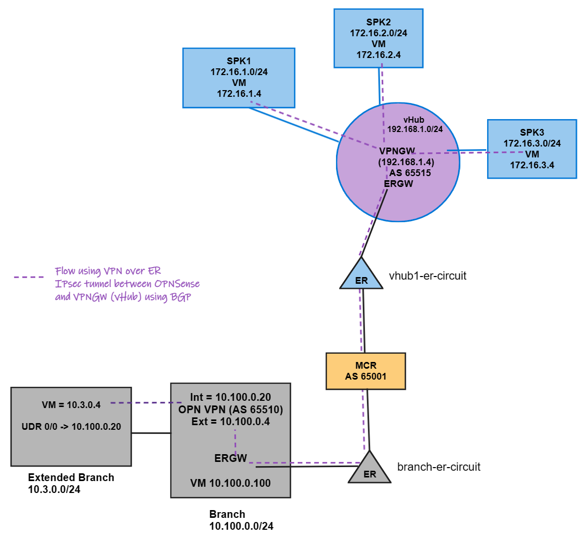

# Lab - Virtual WAN Scenario: IPsec VPN over ER

### Intro

The goal of this lab is to validate IPSec over Express Route using Virtual WAN leveraging only Azure to emulate On-premises.
You can find the official Microsoft reference for that functionality in: [ExpressRoute encryption: IPsec over ExpressRoute for Virtual WAN](https://learn.microsoft.com/en-us/azure/virtual-wan/vpn-over-expressroute)

### Lab diagram



### Deploy this solution

The lab is also available in the above .azcli that you can rename as .sh (shell script) and execute. You can open [Azure Cloud Shell (Bash)](https://shell.azure.com).

Review the parameters below and make changes based on your needs:

```Bash
#Parameters
region=southcentralus
rg=lab-vwan-vpner
vwanname=vwan-vpner
hubname=vhub1
username=azureuser
password="Msft123Msft123" #Please change your password
vmsize=Standard_B1s #VM Size
mypip=$(curl -4 ifconfig.io -s) #Replace with your home Public IP in case you run this over Cloudshell
```

Note that **OPNsense** used as VPN Server has **username:root** and **password:opnsense**

Please, run the following steps to build the entire lab:

#### Step 1 - Deploy the Lab

```bash
wget -O vwan-vpner-deploy.sh https://raw.githubusercontent.com/dmauser/azure-virtualwan/main/vpn-over-er/vpner-deploy.azcli
chmod +xr vwan-vpner-deploy.sh
./vwan-vpner-deploy.sh
```

#### Step 2 - Provision ER Circuits with Provider

Ensure that ExpressRoute Circuits er-circuit-vhub1 and er-circuit-branch are provisioned. That is required to connect them to the respective ER Gateways in Step 3.

#### Step 3 - Connect ER Circuit

In this step, the script below connect branch-er-circuit to the Branch ER Gateway and vhub1-er-circuit to the vHub ER Gateway.

```bash
wget -O vwan-vpner-conn.sh https://raw.githubusercontent.com/dmauser/azure-virtualwan/main/vpn-over-er/vpner-deploy.azcli
chmod +xr vwan-vpner-conn.sh
./vwan-vpner-conn.sh
```

### Validation

Coming soon...